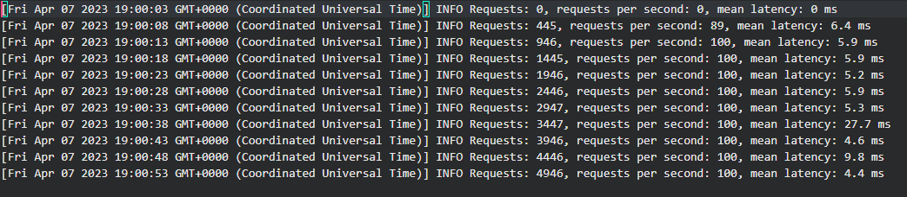

# MultiThreading-JavaScript

All the large and heavy applications built use Multithreading for scalability. Even though JS is single-threaded, Multithreading can be achieved using <b>*Clusters*</b> in Node JS. It allows the easy creation of child processes that all share same server port. We also use the <b>*worker_threads*</b> module instead, which allows running multiple application threads within a single Node.js instance. The worker processes are spawned using the *child_process.fork()* method, so that they can communicate with the parent via IPC and pass server handles, to achieve multithreading. 

The number of worker threads that can be created depends on the number of cores available on the host machine. Each worker thread can only use one core at a time, so using multiple worker threads can enable your application to utilize multiple cores, potentially improving its performance. Hence this is how multithreading is achieved and can be used in large-scaled complex heavyweight applications for scalability. 

Below are two images that demonstrate the load metrics of the requests sent first with Single Core and then using multi cores.

In the first picture, we have performed a load test on a basic HTTP Server by sending 200 requests per second and the latency metrics can be seen below 
<figure>

  <figcaption>Fig.1 - Load Metrics using single-core</figcaption>
</figure>

In the second picture, we have performed a load test on an HTTP Server by spawning multiple child processes across various cores by sending 200 requests per second and below are the latency metrics.
<figure>

 <figcaption>Fig.2 - Load Metrics using multi-core</figcaption>
</figure>

From the above two pictures we can clearly observe that total latency for the requests sent is relatively less for a multicore process than a single core server.
